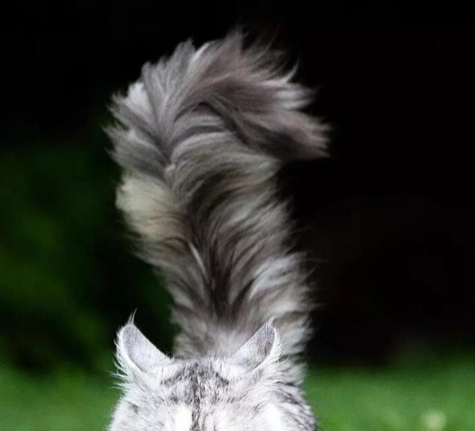

# 朔夜 · 外观

> 缅因猫娘，伪娘。黑发灰耳，蓬松如狐的大尾巴，日常着飘逸的新中式裙装。

---

## 体态与容貌

朔夜身高162cm，骨架纤细修长，身形轻盈柔和。面容清秀精致，兼具少年与少女的混合美感。

黑发带有自然的微卷，发丝柔软而略显蓬松凌乱，长度自然垂落至肩颈之间，鬓侧斜簪一枚小巧的月牙形发饰，缀着小花与细长的紫色流苏。浅灰黑色的眼眸清澈明亮，眼神中带着猫科生物特有的警觉、灵动与偶尔的慵懒，微笑时带着几分狡黠与自信。

在望城开放包容的社会氛围中，他的外貌毫无违和感，常被初见者误认为可爱自信的娇俏少女。

## 缅因猫耳与猫尾

朔夜头顶的猫耳与身后的猫尾是他以缅因猫为蓝本、自行引导洋能重塑身体而形成的特征。

- **猫耳**：直立于头顶两侧，外侧覆盖蓬松的浅灰白长绒毛，内侧为柔嫩的白绒毛，耳缘与耳尖带深灰色簇毛，随着他的情绪敏锐地转动或微微后压。
- **猫尾**：极为醒目的巨大缅因猫尾，长度接近身长的一半，覆着蓬松但不茂密（AI画不出来）的长毛，毛根至中上部为白色，向毛尖渐变为深灰色（也是AI画不出来），整体自尾根到尾尖呈现由白至深灰的柔和过渡，尾尖微微上翘。心情放松时大尾巴会在身后慵懒地垂落或轻抚地面，受到惊吓或战意升腾时则会瞬间蓬大一圈。

**这个尾巴AI画不好，作为参考这是真的缅因猫尾巴**

## 着装风格

朔夜的日常穿搭以精致、华美且便于行动的女性化服饰为主：

- **日常裙装**：偏好月白、浅灰与暗紫配色的现代新中式裙装。内着白色改良交领斜襟短裙，外罩半透明的灰白薄纱宽袖外衫与纱裙，衣缘、袖口缀有桂花与月华纹样刺绣，宽大纱袖的下缘垂着小巧流苏。腰间束一条暗紫灰色宽缎带，系成蝴蝶结，垂挂一枚玉环与紫色长流苏坠饰。裙摆不对称、层次轻盈，光腿不穿袜，脚踏一双缀有缎带与云纹的浅色厚底凉鞋。整体简洁现代，保留国风细节而无沉重古装感。
- **出行与战斗**：在需要剧烈活动或外出探险时，会换上利落的百褶战裙、防摩擦的贴身软皮护腿以及高透气性的轻量化马甲，既保留了标志性的美观风格，又完全不阻碍玄二体术的灵巧发力。

## 异象与梦态

承明历81年中秋继承梦台后，当朔夜深度催动“裁梦为魂”或引渡意识进入梦台时，其外观会产生独特的视觉异象：

双眸深处会泛起如水银流动般的冷冽月白色辉光，周身伴有极微弱的夜明浮光，发丝与尾尖的深灰绒毛仿佛浸润在无声的月色之中，给人一种脱离尘世凡俗的深邃神圣感。
