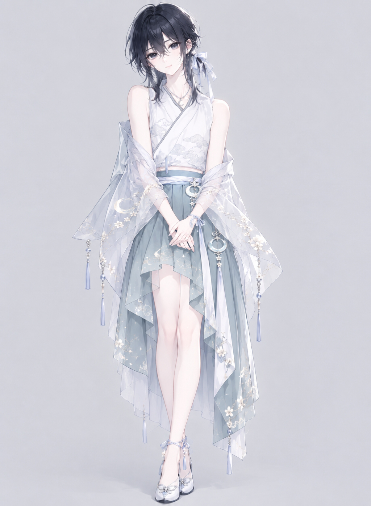

# 望舒 · 外观

---

## 体态与容貌

望舒身高约 170cm，体态纤细修长，骨架轻盈柔韧，呈现出标致的少年轮廓。

由于生命本质已完全转化为纯洋能生物，其肌肤呈现出细腻无瑕、如冷玉般的微凉白皙。五官清秀温润，眉目如画，既带有峰值时代古典壁画中方士与仙童的清冷出尘，又因少年心性保留着一抹天然的纯真与柔和。

黑发如墨，发质柔软顺滑，长度自然垂落至颈间锁骨，偶尔在耳后扎一束随意的短发揪。双眸为深邃纯净的墨黑色，眼神平静清澈。

## 纯正的人类形体

与主角团其他成员（茉璃黑猫、浅紫白狐狸、朔夜缅因猫）不同，望舒**始终保持着纯粹的人类外观**。

## 着装风格与日常伪娘装扮

望舒的服饰风格在重返地球后经历了戏剧性的转变：

- **古典素雅（最初偏好）**：在亚空间时期及初归地球时，习惯穿着素色布料缝制的宽袖长袍，风格素净、飘逸出尘；
- **望城同居后的日常女装**：搬入望城与朔夜同居后，在朔夜充满热情与掌控欲的“女装进攻”下，望舒的衣柜被彻底重构。面对望城高度包容的亚文化氛围，他从最初的不知所措、任由朔夜摆布试穿，逐渐被带偏并完全适应：
- **外出与逛街**：常被朔夜搭配成套的精致水手服、和风改良系带短裙，当然他本人最喜欢的还是汉服；
