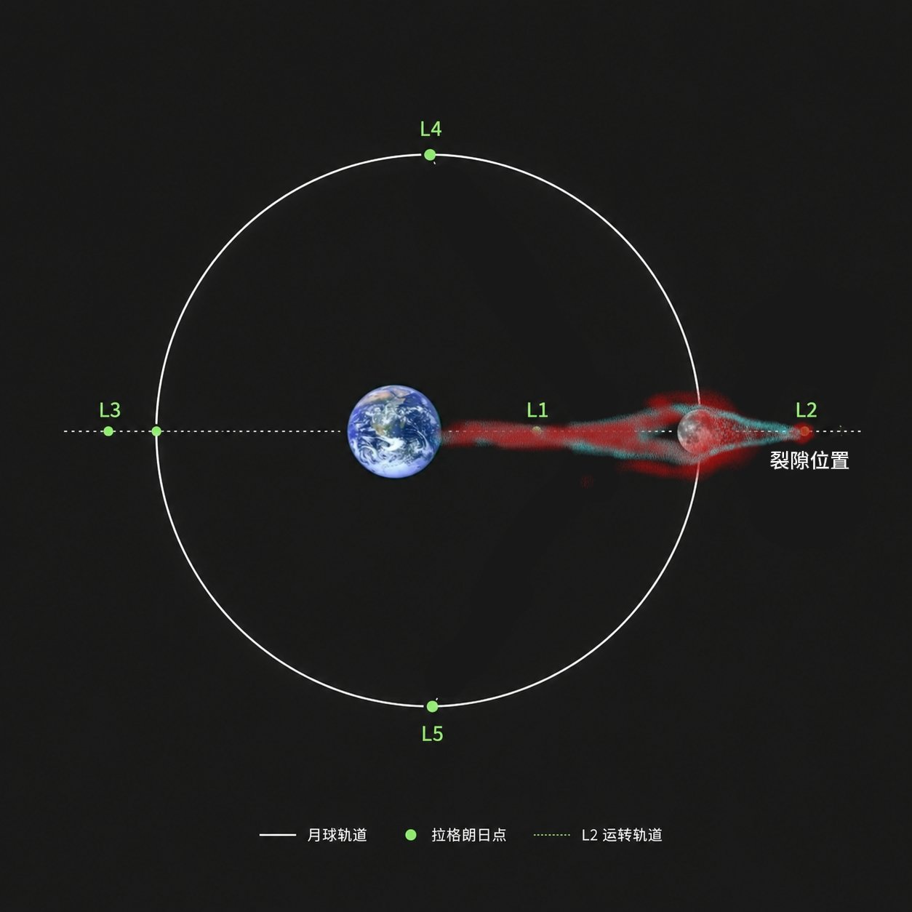

# 望舒 · 经历

---

## 峰值时代与远走亚空间（约3200年前）

约三千七百年前，亚空间洋能通过星银山脉裂隙暴涌，地球迎来了长达两百四十年的洋能峰值时代。

在这场席卷全球的能量狂潮中，九成人类在无法承受的冲击下发生沉渊与异化，而少年望舒则凭借极其罕见的体质与精神亲和力，成为了极少数成功驾驭高浓度洋能的“天选者”之一。

约3200年前，随着峰值时代的退潮，洋能浓度断崖式下跌。面对力量消退与肉身崩溃的绝境，星银山脉数十名天选者在岩壁刻下《梦境汪洋》后集体跃入裂隙殉道；而望舒并未参与那场悲壮的集体沉沦，他在衰退期末期，怀揣着对未知与生命延续的探索，独自穿透一道隐秘的裂缝，步入了广袤无垠的亚空间之中。

## 漂泊

在没有日夜更迭、亦无方向上下的亚空间洋域中，望舒漂泊了近三千年。

在这个过程中，他的肉身代谢逐步被高密度的洋能环境所重构。原始生命镜像底层的碳基块在一次次轮换中彻底被纯净的洋能介质所替代，他自然而然地脱离了肉体凡胎，蜕变为了纯正的洋能生物，其能层能级亦在漫长的锤炼中稳步攀升至 4f 的极高位阶。

然而，在漫长而绝对孤寂的亚空间环境中，缺乏扰动与他者的干涉，望舒不可避免地滑向了对某种纯粹拓扑秩序与极致静谧的单向度优化。他的思维梯度逐渐归零，感知维度不断收窄，曾极接近了“神明”的边界，当时的他距离彻底沦为僵死的局部最优解只差临门一脚。

就在收敛即将彻底闭合之际（约420年前），他成功建立了梦台。当故乡人间文明那纷繁、无序、鲜活的情感噪声与命运分支重新撞入他的感知时，巨大的外部复杂性将他从局部最优解中拉了回来**，重新唤醒了他作为“人”的鲜活情感与主观心智。

## 缔造梦台与守护人间（约420年前）

从神明深渊边缘被文明唤醒后，望舒深知文明的喧嚣与随机性是对抗局部最优的唯一锚点。然而，严酷的天体物理与空间法则带来了难以逾越的鸿沟

望舒在亚空间探明的空间裂隙，固定锚定在地月系统的 L2 拉格朗日点（位于月球背对地球一侧的深空，随地月系统同步运转）。这意味着月球的物理实体常年遮挡在视线前方，望舒在亚空间内完全无法直接目视地球，亦无实时宏观视野。

他只能看到月亮，从任何角度都无法见到陆地，他只能推测陆地在月亮后面，又无法知道这里到陆地的距离，外太空既无洋能环境亦无介质，本地泡环境魔力极度稀薄，望舒自觉无法肉身渡空，更无法在离开裂隙后维持长期消耗。

为了与故乡文明建立连接，望舒摸索出了一套精妙的跨深空洋能投送构想“梦台”：

在日常状态下，望舒持续从 L2 裂隙向月球背面及环月空间补充释放洋能，形成稳定的环月洋能储备带；

在平时的运行轨道中，太阳引力与地月连线存在明显夹角，侧向引力摄动会严重破坏洋能的传输轨迹。唯有在每月农历十五（望日）前后，地月 L2 点、月球、地球、太阳四者近似连成一线（L2 >>> 月球 >>> 地球 >>> 太阳）。此时太阳引力不再是干扰，反而转变为沿着传输连线朝向地球方向的天然助推拉力；

望舒在农历十五的对齐窗口期自 L2 释放推进洋能束，将环月累积的储备洋能整体推离月球的引力范围，随后洋能在地心引力的拉动下顺畅飞往地球；

洋能抵达地球后，在大气层与地表形成具有空间梯度的投影（中心洋能浓度最高，向外递减；局部浓度越高，梦境引渡越深）。由于月球白道面进动与倾角摆动，投影中心在一年各月中扫过地球不同纬度。望舒身处月背盲区，无法直接俯瞰人间，四百二十年间，他完全依靠每月梦台引渡带回的凡人梦境与记忆碎片，在静谧的亚空间中拼凑着对故乡文明的认知。

## 中秋血月与托付梦台（承明历81年9月27日）

承明历81年秋，因月球白道面的周期性摆动，洋能地表投影中心恰好精准对准了承明大陆西北的望城。在长达四百二十年的记忆碎片拼凑中，望舒敏锐地感知到了朔夜的存在——这是他四百多年来在地球上观测到的唯一一位脱离了碳基底层、由洋能主导生存的人形生物（使徒）。

为了打破物理盲区的隔阂、与这位空前绝后的同类建立直接接触，望舒在八月十五中秋节这天自地月L2裂隙向月球方向喷射出空前庞大的推进洋能，将月球背面积攒的储备洋能大量推出。

洋能本身并无固定颜色，但在极高浓度与强推进激化下，这股浩瀚的活跃洋能大量吸收了短波长光线，并在能量转化中剧烈辐射出耀眼的红光。月球与夜空因此被照耀得通体通红，在地球夜空引发了一场持续整整一天、亮度极高的罕见“极亮血月”，震惊全球天文界；

在庞大活跃洋能的层层托举与接引下，独居望城的朔夜不仅在深度昏迷中沉入第6层梦境，更最终以纯粹的灵魂形态穿透第6层，成功降临至第7层潜空间（即真实的亚空间边缘）。

在这片静谧深空中，两位洋能生命跨越了三千年的历史鸿沟终得相见。面对这位兼具使徒底质与现代思维的少年，望舒在漫长的交谈后释然一笑，将梦台的核心法门与印记正式传授给了朔夜。望舒自己依然保留了梦台的基础能力，但主要限于宏观观测与引渡；而朔夜在接掌后，则在此基础上衍生出了望舒此前从未涉足的灵魂系精细重塑能力（“裁梦为魂”）。随着朔夜苏醒，深空中的活跃洋能平息，持续一整天的极亮血月亦骤然褪色恢复皓白。

## 梦中再会与归途决意（承明历81年11月）

血月过去后，朔夜急切地想要寻找将望舒接回地球的方法。他立即去星月湾找茉璃，得知茉璃拥有在复用区主动开启裂隙的能力，于是求助茉璃。茉璃在望城郊外五十多公里的荒郊野岭山洞中尝试开起裂隙，然而探测结果却令人绝望：梦台无论如何都无法与望舒建立一丝一毫的联系，这只能说明望舒至少在数百万千米之外。在广袤的亚空间中，根本无法在短时间内肉身穿行如此漫长的距离将望舒接出。

10月中旬，朔夜在翻阅现代天文新闻时灵光乍现：下个月的满月之夜恰好会发生一次月全食。这意味着太阳、地球、月球与L2点将迎来近乎完美的几何对齐，天体引力助推将达到理论上的最强峰值，这是千载难逢的最佳归返窗口。

这让朔夜重新燃起了信心，在几天后的满月，他来到了能够直接沐浴到望舒输送过来的洋能的区域。

第一次遇见的时候，望舒就向朔夜解释了入梦深度的底层天象原理（地表投影位置），推翻了朔夜此前以为梦境深度是梦台固定阶梯的主观推测。

望舒如期高强度驱动梦台引渡。由于朔夜与望舒的梦台同宗同源，这一次，朔夜带着茉璃一同沉入梦境，两人以纯粹的灵魂形态再次穿透潜空间，直接投影降临到了亚空间之中。

三千年来第一次有人主动踏入这片空间，望舒震惊不已。更让他意外的是，朔夜身旁的娇小少女茉璃，竟然也是一位货真价实的纯正洋能生物。

而现在茉璃与朔夜向望舒详细交代了茉璃开启裂隙的经过，并向望舒科普了地球现代科学测定的真实地月距离，此前他无法知道这个距离，万一有几百万公里他无论如何都过不去。

茉璃结合望舒雄浑无比的能量底蕴进行了测算，得出了振奋人心的结论：望舒凭借自身洋能肉身横渡三十八万公里加上这个位置到月球的5万公里真空飞回地球完全可行，横渡深空后至少还能保留一半的充沛洋能！

望舒沉思了许久，最终决定：“不管是死是活，我都一定要回去看看。”三人约定，下个月食之日，便是望舒归乡之时。

## 渡空入界与降临洛神洋（承明历81年10月28日）

在随后的一个月里，望舒在亚空间自L2处的裂隙源源不断地向月球表面倾泻输送洋能，将整颗月球构筑为他肉身渡空的星际能量补给站。

承明历81年10月28日，农历九月十五，月食之夜如期降临。

在地月日连成一线的瞬间，望舒在亚空间内深吸一口气，悍然一跃穿透裂隙，如同一道白虹般破空而出，直奔月球。在月球地表吸满洋能后，天选者少年再次起飞，肉身扎入了冰冷死寂的三十八万公里深空真空之中。

依靠天体引力的天然牵引与 4f 力场的精准矢量推进，望舒以极高航速在深空中疾驰。历经两夜的平稳飞跃，第二天夜里，蔚蓝而壮丽的地球母星已清晰地呈现在他的眼前。

望舒始终牢牢谨记临行前朔夜的郑重叮嘱：“接近地球会有一片无形的火海。”

当他逼近地球卡门线边缘时，稠密的大气摩擦造型的高热如期而至。望舒没有丝毫慌乱，开始运转洋能。狂暴的高温与激波被层层偏折导流，他宛如一颗璀璨纯净、拖着淡淡青白流光的流星，自天顶呼啸划破夜幕，在承明大陆南方的夜空中留下了一道震撼世人的明亮轨迹。

依照先前的约定，望舒在重力与大气的层层减速下精准调整姿态，俯冲穿过云层，飞向了三千两百年前天选者们的故地星银山脉脚下的洛神洋。

海面上被压出一圈圈巨大而温润的白色浪环。随后，疾风骤歇，少年轻盈地停滞身形，双足稳稳悬浮在如镜的海面之上，足尖距离翻涌的微波不过数寸。

夜风带着三千两百年未曾嗅到过的微咸水汽拂过脸颊。就在临海的星银山脉悬崖边，早已守候多时的朔夜与茉璃自夜色中开着快艇而来。

跨越了三千两百年的无尽漂泊，天选者终于真正回到了家。

## 重返地球与望城同居

在星银山脉与两人汇合后，望舒随朔夜返回望城，定居在望城的一座高端公寓中。

回到望城后，望舒日常只需依靠茉璃在望城东偏北约五十公里的山间洞穴中开启的稳定亚空间裂隙，即可定期肉身飞行前往吸饱洋能，从而完美维持常消耗。

面对望城极其开放包容的亚文化浪潮，以及朔夜充满“猫系审美”的热情攻势，原本超凡脱俗的天选者少年在短短数月内，被朔夜用满衣柜精致的洛丽塔裙、水手服和甜品一点点“攻陷”，彻底习惯了女装与伪娘的日常，成为望城街头一道不为人知的绝美风景。