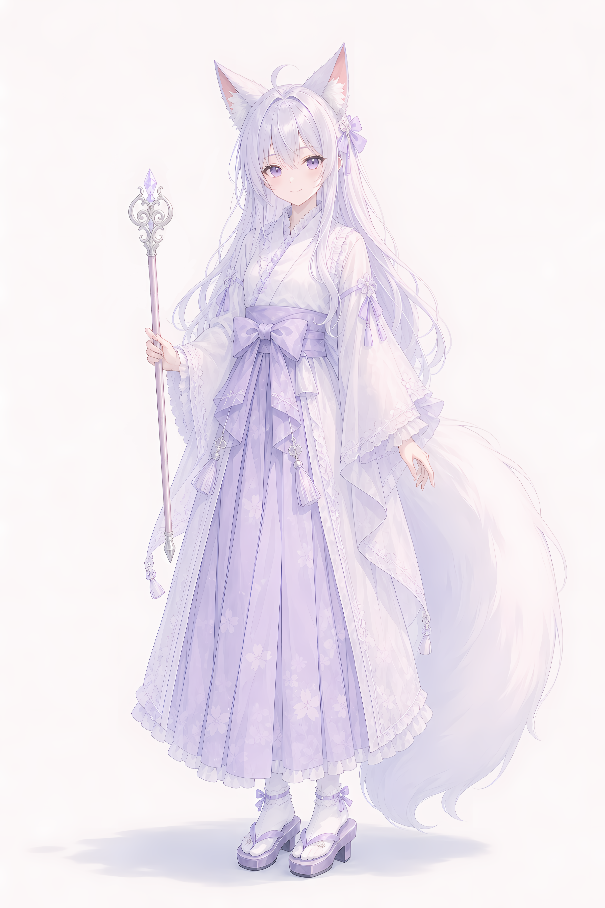

# 浅紫 · 外观

## 基础数据

约19岁，身高165cm，肤色白皙细腻。体型匀称偏纤细，骨架小巧，四肢修长柔美。

## 头部

银白色中透着极淡的薰衣草紫，柔和的浅冷色调。长直发，发丝柔顺，长及腰，发尾带有轻微自然波浪。轻薄的侧分刘海，脸颊两侧留有细长鬓发。头顶有一缕不是很明显的翘起发丝，增添活泼感。右侧发间点缀一枚淡紫色缎带蝴蝶结发饰。

瞳色是明亮的淡紫罗兰色，圆形日系动漫大眼，带有细腻高光和睫毛，眼神温柔。唇色淡樱花粉，眼角带有若有若无的淡粉色晕染，仿佛微醺，增添柔媚感。神态恬淡柔和，嘴角微微上扬，眼神平静而亲切。

## 狐耳

一对大型三角形狐耳矗立在头顶两侧，略靠后，与头部比例协调，醒目但不突兀。外侧覆盖着与发色同色的淡紫白色绒毛；内侧是浅粉色皮肤，耳窝深处有浓稠柔软的白色绒毛。质感蓬松柔软，边缘略带透明感。

> 狐耳是跨越前自行用洋能添加的，不是天生，不是跨越副产品。

## 尾部

雪白色的狐尾，比头发更偏白，阳光下泛极淡的银紫色光泽。粗大，毛发极其蓬松饱满，尾尖带有自然卷曲的弧度，长度几乎能垂至地面。质感柔软如云朵，原生态纯净感，无尾饰。

> 狐尾同样是跨越前自行用洋能添加的。

## 服装

整体以紫与白为主色调，层次丰富。内层是一件纯白色的交领中衣，领口呈"Y"字形交叠，领口及襟边有精致的白色蕾丝滚边。

外面罩着一件半透明的白色蕾丝长外衣，类似轻薄的羽织或披肩，可透出内层衣物的淡紫白色调。袖子宽大呈钟形，袖口缀有一圈白色蕾丝花边，并有淡紫色缎带蝴蝶结点缀。衣摆及小腿边缘呈不规则的多层荷叶边造型，同样有蕾丝收边，下摆点缀小巧的流苏吊饰，行走时轻摆。

下装是一条薰衣草紫的长裙，裙摆宽大垂坠，几乎及踝，裙身印有比底色更浅淡的樱花暗纹。腰部系着淡紫色宽腰带，腰前正中央打成一个大大的蝴蝶结；腰带下方垂有多层不规则的荷叶边裙摆装饰，边缘悬挂数枚淡紫色流苏吊坠，增添飘逸感。

足履为白色短筒袜，袜口有淡紫色缎带蝴蝶结环绑，搭配淡紫色木屐，紫色鼻绪，深色厚底鞋跟，行走时发出清脆的木屐声。

## 配饰

整体风格精致但不繁复。点缀有发间蝴蝶结、袖口蝴蝶结、腰部蝴蝶结及流苏吊坠、足袜蝴蝶结。无额外发饰、耳饰、颈饰或手饰。

## 气质

温婉空灵，兼具少女的清纯与非人类的灵动感。如同春日紫藤花下化身的狐仙少女。第一印象是"安静又惹人怜爱的狐娘少女"。

## 法杖

杖身为淡粉色木质，手感温润。尾部是黄铜锥形端盖，可用于支撑地面。头部是精致的银白色金属浮雕杖头，镶嵌一枚紫色水晶，杖头花纹繁复优美。长度约55cm，约三分之一身长。无特殊结构，与其他武器一样可以作为释放洋能的工具，贯态洋能通过杖身水晶聚焦后精度更高。

法杖是父母在她成功跨越后制作的礼物。浅紫很早就跟父母说过她改变主意了，不想当剑客，想当魔法少女。
